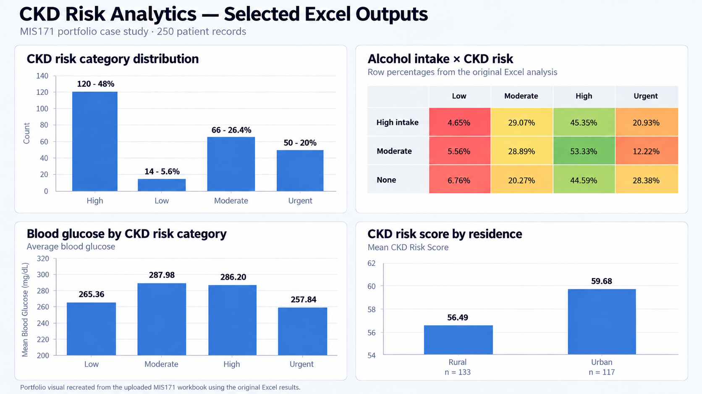

# CKD Risk Analytics & Dashboard



> Portfolio visual recreated from the original Excel outputs in the uploaded MIS171 workbook.

**Excel · Data Analytics · Statistical Analysis · Regression**

## Project Overview

This project analyses a **250-patient chronic kidney disease (CKD) dataset** in the context of a hospital renal unit. The broader MIS171 work combines Excel-based visual analysis with descriptive statistics, probability analysis, confidence intervals, hypothesis testing, correlation analysis, and regression.

The objective was to identify patterns associated with CKD risk, communicate them clearly, and translate the analysis into practical insights for a healthcare decision-making context.

## Excel Analysis

The uploaded workbook contains analytical worksheets covering:

- CKD risk-category distribution
- CKD risk and alcohol-intake cross-tabulation
- Blood urea analysis by CKD risk
- Correlation analysis for clinical variables
- Probability analysis using physical activity and blood pressure
- 95% confidence intervals for blood glucose
- Hypothesis testing by residence

The preview at the top of this README uses the **actual results from that workbook**, reformatted into a cleaner portfolio presentation.

## Analytical Methods

Methods demonstrated across the project include:

- PivotTables and cross-tabulation
- Descriptive statistics
- Probability analysis
- Confidence intervals
- Hypothesis testing
- Correlation analysis
- Scatterplots
- Multiple linear regression
- Dummy variables for categorical predictors
- Multicollinearity review
- Iterative removal of non-significant predictors
- Prediction and confidence intervals

## Selected Findings

### CKD Risk Distribution

The 250-patient dataset was distributed across the workbook's CKD risk categories as follows:

| CKD Risk Category | Patients | Proportion |
| --- | ---: | ---: |
| High | 120 | 48.0% |
| Low | 14 | 5.6% |
| Moderate | 66 | 26.4% |
| Urgent | 50 | 20.0% |

### Physical Activity

Average CKD Risk Score differed across physical-activity groups:

| Activity Level | Mean CKD Risk Score | Standard Deviation |
| --- | ---: | ---: |
| Active | 58.98 | 17.81 |
| Inactive | 54.08 | 15.00 |
| Typical | 59.59 | 19.36 |

### Blood Glucose

Mean blood-glucose values by CKD risk category were:

| CKD Risk Category | Mean Blood Glucose | 95% CI |
| --- | ---: | ---: |
| Low | 265.36 | 203.38–327.33 |
| Moderate | 287.98 | 260.02–315.95 |
| High | 286.20 | 263.70–308.70 |
| Urgent | 257.84 | 223.19–292.49 |

### Residence

The analysis found the following average CKD Risk Scores:

- **Rural:** 56.49 across 133 patients
- **Urban:** 59.68 across 117 patients

The workbook's conclusion reported both group means as significantly above 50 (*p* < 0.001).

### Regression

A separate regression stage of the broader MIS171 project was used to evaluate multiple predictors of CKD Risk Score.

The final model explained approximately **76% of the variation in CKD Risk Score** (**R² ≈ 0.76; adjusted R² ≈ 0.75**).

Selected model results included:

- Diabetes: coefficient ≈ **+10.40**, *p* < 0.001
- Hypertension: coefficient ≈ **+8.94**, *p* < 0.001
- Packed Cell Volume: coefficient ≈ **+0.33**, *p* = 0.038
- Red Blood Cell Count: coefficient ≈ **−1.82**, *p* = 0.001
- Haemoglobin: coefficient ≈ **−2.81**, *p* = 0.020

## CKD Risk Categories

The uploaded workbook labels the score thresholds as:

- **<30 — Low**
- **<50 — Moderate**
- **<75 — High**
- **>75 — Urgent**

## Repository Structure

```text
ckd-risk-analytics-dashboard/
├── README.md
├── ckd-analysis-preview.png
├── analysis_summary.md
└── key_results.csv
```

## Skills Demonstrated

**Excel · Data Visualisation · PivotTables · Descriptive Statistics · Probability · Confidence Intervals · Hypothesis Testing · Correlation · Multiple Regression · Data Interpretation · Business Analytics**

## Project Context

This portfolio case study consolidates work completed in **MIS171** at Deakin University. University submission identifiers and personal details have been excluded from this public repository.
